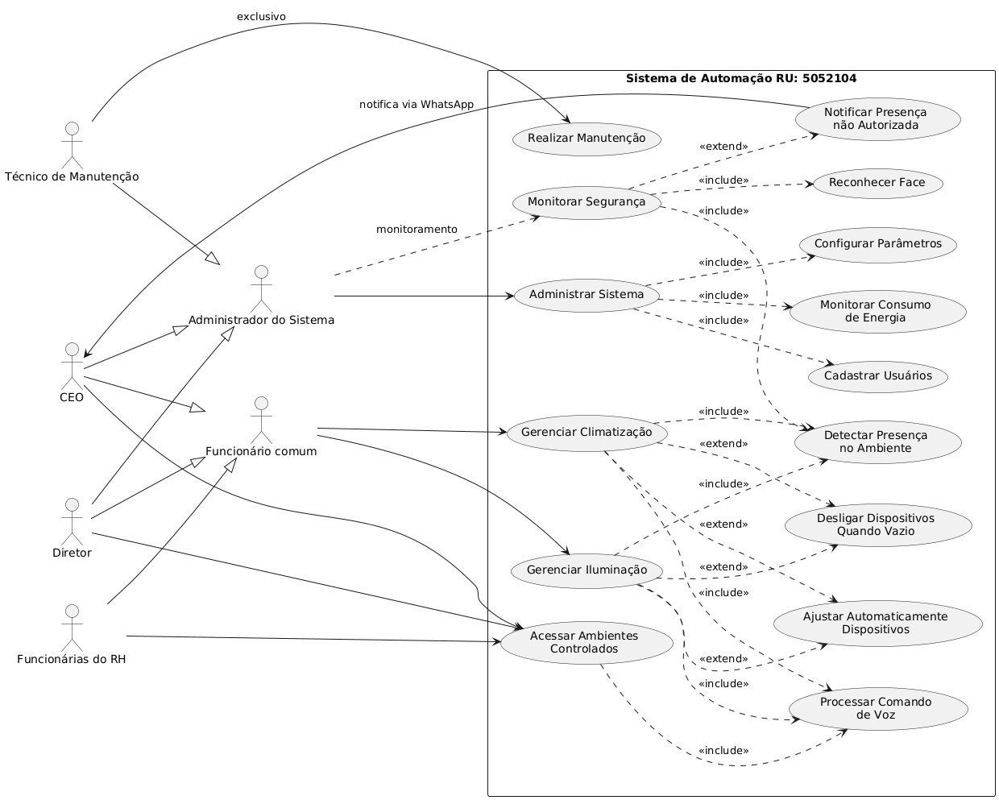
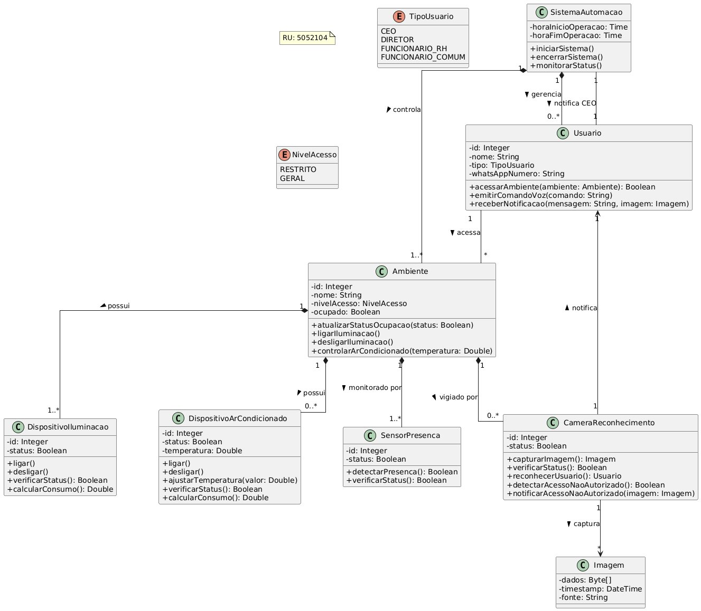

# Bergaworks Money — Sistema de Automação Empresarial

> [!NOTE]
> Este é um projeto de **Análise e Modelagem de Sistemas** desenvolvido para a UNINTER (2025). O foco é a estruturação teórica e técnica de uma solução de automação inteligente.

---

## 📝 Sobre o Projeto

A **Bergaworks Money** é uma empresa fictícia utilizada como estudo de caso para a disciplina de Análise e Modelagem de Sistemas. O objetivo foi desenvolver a análise completa de um sistema de automação inteligente para o ambiente de trabalho da empresa, cobrindo desde o levantamento de requisitos até a modelagem orientada a objetos.

O sistema proposto automatiza:

- 💡 Iluminação e Climatização: Ajuste inteligente de luz e temperatura.
- 🔐 Controle de Acesso: Reconhecimento facial integrado.
- 🗣️ Acessibilidade: Suporte total por comandos de voz (focado em inclusão para PCD visual).
- 📱 Notificações: Alertas em tempo real via WhatsApp.

> [!TIP]
> A integração com o WhatsApp foi pensada para manter a gestão informada em tempo real sobre acessos não autorizados, aumentando a segurança sem a necessidade de apps complexos.

---

## 🛠️ Metodologia

O projeto seguiu o fluxo clássico de análise de sistemas:

```
Entrevista com a cliente (coleta de requisitos)
        ↓
Levantamento de Requisitos Funcionais e Não Funcionais
        ↓
Diagrama de Caso de Uso
        ↓
Diagrama de Classes
```

> [!IMPORTANT]
> Os requisitos foram coletados a partir de entrevista com a responsável pela empresa, utilizando técnicas de perguntas abertas e fechadas para mapear problemas, urgências e soluções desejadas.

---

## 👥 Atores do Sistema

| Ator                     | 🎭 Papel                                                   |
| ------------------------ | ---------------------------------------------------------- |
| CEO                      | Recebe notificações de acesso não autorizado via WhatsApp  |
| Diretor                  | Acessa ambientes controlados por comando de voz            |
| Funcionárias do RH       | Acessam ambientes controlados por comando de voz           |
| Funcionário Comum        | Interage com iluminação e climatização                     |
| Administrador do Sistema | Configura parâmetros, cadastra usuários e monitora consumo |
| Técnico de Manutenção    | Realiza manutenção do sistema                              |

---

## 🔄 Diagrama de Caso de Uso



_Diagrama criado utilizando a ferramenta [PlantUML](https://plantuml.com/use-case-diagram)_

<details>
<summary>Ver código</summary>

```
@startuml
left to right direction
skinparam packageStyle rectangle

' Atores principais do sistema (apenas entidades externas)
actor "CEO" as ceo
actor "Diretor" as diretor
actor "Funcionárias do RH" as rh
actor "Técnico de Manutenção" as tecnico

' Atores de agrupamento para herança
actor "Funcionário comum" as funcionario
actor "Administrador do Sistema" as admin

' Pacotes e casos de uso
rectangle "Sistema de Automação" {
  ' Casos de uso principais - focados em objetivos dos usuários
  usecase "Acessar Ambientes\nControlados" as UC_Acesso
  usecase "Gerenciar Iluminação" as UC_Iluminacao
  usecase "Gerenciar Climatização" as UC_Clima
  usecase "Monitorar Segurança" as UC_Seguranca
  usecase "Administrar Sistema" as UC_Admin
  usecase "Realizar Manutenção" as UC_Manutencao

  ' Funcionalidades incluídas em outros casos de uso
  usecase "Detectar Presença\nno Ambiente" as UC_DetectarPresenca
  usecase "Reconhecer Face" as UC_ReconhecerFace
  usecase "Processar Comando\nde Voz" as UC_ComandoVoz
  usecase "Cadastrar Usuários" as UC_CadastrarUsuarios
  usecase "Configurar Parâmetros" as UC_ConfigurarParam
  usecase "Monitorar Consumo\nde Energia" as UC_MonitorarEnergia

  ' Extensões para comportamentos automáticos
  usecase "Notificar Presença\nnão Autorizada" as UC_Notificar
  usecase "Ajustar Automaticamente\nDispositivos" as UC_AjusteAuto
  usecase "Desligar Dispositivos\nQuando Vazio" as UC_DesligarAuto
}

' Relacionamentos específicos entre atores e casos de uso
ceo --> UC_Acesso
diretor --> UC_Acesso
rh --> UC_Acesso

ceo <-- UC_Notificar : notifica via WhatsApp

tecnico --> UC_Manutencao : exclusivo

' Herança entre atores
ceo --|> funcionario
diretor --|> funcionario
rh --|> funcionario

ceo --|> admin
diretor --|> admin
tecnico --|> admin

' Relacionamentos de funcionalidades por tipo de ator
funcionario --> UC_Iluminacao
funcionario --> UC_Clima

admin --> UC_Admin
admin ..> UC_Seguranca : monitoramento

' Relacionamentos entre casos de uso
UC_Iluminacao ..> UC_DetectarPresenca : <<include>>
UC_Clima ..> UC_DetectarPresenca : <<include>>
UC_Seguranca ..> UC_DetectarPresenca : <<include>>
UC_Seguranca ..> UC_ReconhecerFace : <<include>>

UC_Acesso ..> UC_ComandoVoz : <<include>>
UC_Iluminacao ..> UC_ComandoVoz : <<include>>
UC_Clima ..> UC_ComandoVoz : <<include>>

UC_Admin ..> UC_CadastrarUsuarios : <<include>>
UC_Admin ..> UC_ConfigurarParam : <<include>>
UC_Admin ..> UC_MonitorarEnergia : <<include>>

UC_Seguranca ..> UC_Notificar : <<extend>>

UC_Iluminacao ..> UC_AjusteAuto : <<extend>>
UC_Clima ..> UC_AjusteAuto : <<extend>>

UC_Iluminacao ..> UC_DesligarAuto : <<extend>>
UC_Clima ..> UC_DesligarAuto : <<extend>>

@enduml
```

</details>

---

## 🏗️ Diagrama de Classes



_Diagrama criado utilizando a ferramenta [PlantUML](https://plantuml.com/class-diagram)_

<details>
<summary>Ver código</summary>

```
@startuml
skinparam classAttributeIconSize 0
skinparam monochrome false
skinparam shadowing false
skinparam backgroundColor white
skinparam nodesep 80
skinparam ranksep 100
skinparam linetype ortho

' Enumerações simplificadas
enum TipoUsuario {
  CEO
  DIRETOR
  FUNCIONARIO_RH
  FUNCIONARIO_COMUM
}

enum NivelAcesso {
  RESTRITO
  GERAL
}

' Classe principal do sistema
class SistemaAutomacao {
  -horaInicioOperacao: Time
  -horaFimOperacao: Time
  +iniciarSistema()
  +encerrarSistema()
  +monitorarStatus()
}

' Classes de entidades - apenas as essenciais
class Usuario {
  -id: Integer
  -nome: String
  -tipo: TipoUsuario
  -whatsAppNumero: String
  +acessarAmbiente(ambiente: Ambiente): Boolean
  +emitirComandoVoz(comando: String)
  +receberNotificacao(mensagem: String, imagem: Imagem)
}

class Ambiente {
  -id: Integer
  -nome: String
  -nivelAcesso: NivelAcesso
  -ocupado: Boolean
  +atualizarStatusOcupacao(status: Boolean)
  +ligarIluminacao()
  +desligarIluminacao()
  +controlarArCondicionado(temperatura: Double)
}

class DispositivoIluminacao {
  -id: Integer
  -status: Boolean
  +ligar()
  +desligar()
  +verificarStatus(): Boolean
  +calcularConsumo(): Double
}

class DispositivoArCondicionado {
  -id: Integer
  -status: Boolean
  -temperatura: Double
  +ligar()
  +desligar()
  +ajustarTemperatura(valor: Double)
  +verificarStatus(): Boolean
  +calcularConsumo(): Double
}

class SensorPresenca {
  -id: Integer
  -status: Boolean
  +detectarPresenca(): Boolean
  +verificarStatus(): Boolean
}

class CameraReconhecimento {
  -id: Integer
  -status: Boolean
  +capturarImagem(): Imagem
  +verificarStatus(): Boolean
  +reconhecerUsuario(): Usuario
  +detectarAcessoNaoAutorizado(): Boolean
  +notificarAcessoNaoAutorizado(imagem: Imagem)
}

class Imagem {
  -dados: Byte[]
  -timestamp: DateTime
  -fonte: String
}

' Relacionamentos simplificados
SistemaAutomacao "1" *-- "0..*" Usuario : gerencia >
SistemaAutomacao "1" *-- "1..*" Ambiente : controla >
SistemaAutomacao "1" -- "1" Usuario : notifica CEO >

Ambiente "1" *-- "1..*" DispositivoIluminacao : possui >
Ambiente "1" *-- "0..*" DispositivoArCondicionado : possui >
Ambiente "1" *-- "1..*" SensorPresenca : monitorado por >
Ambiente "1" *-- "0..*" CameraReconhecimento : vigiado por >

Usuario "1" -- "*" Ambiente : acessa >
CameraReconhecimento "1" --> "*" Imagem : captura >
CameraReconhecimento "1" --> "1" Usuario : notifica >

@enduml
```

</details>

---

## 📂 Documentação

| Documento                                                           | Descrição                             |
| ------------------------------------------------------------------- | ------------------------------------- |
| [📄 Requisitos Funcionais](docs/functional-requirements.md)         | RF01–RF06 com descrição completa      |
| [📋 Requisitos Não Funcionais](docs/non-functional-requirements.md) | RNF01–RNF06 com categoria e descrição |

---

## 🧠 Conceitos explorados

Este projeto documenta os seguintes conceitos de análise e modelagem de sistemas na pasta [`concepts/`](concepts/):

| Conceito                                                                                           | Descrição resumida                                                                                  |
| -------------------------------------------------------------------------------------------------- | --------------------------------------------------------------------------------------------------- |
| [📘 Engenharia de Requisitos](concepts/requirements-engineering.md)                                | O processo de entrevista → extração → documentação de requisitos                                    |
| [⚖️ Requisitos Funcionais e Não Funcionais](concepts/functional-vs-non-functional-requirements.md) | Como distinguir o que o sistema faz do como ele deve ser                                            |
| [📐 Diagrama de Caso de Uso](concepts/use-case-diagram.md)                                         | Como construir o diagrama com atores, casos de uso, `<<include>>` e `<<extend>>`                    |
| [💎 Diagrama de Classes](concepts/class-diagram.md)                                                | Como extrair classes dos requisitos e modelar atributos, métodos e relacionamentos                  |
| [🔄 Conversão de Requisitos em Classes](concepts/requirements-to-classes.md)                       | Passo a passo para transformar substantivos e verbos dos requisitos em classes, atributos e métodos |

_Os arquivos de conceito explicam como cada artefato foi construído a partir do zero, com exemplos extraídos diretamente do projeto._

> [!CAUTION]
> A implementação real deste sistema requer hardware específico (sensores/atuadores). Este repositório foca exclusivamente na Análise e Modelagem.

---

## 👩‍💻 Autora

**Giselle S.**  
Análise e Desenvolvimento de Sistemas — UNINTER · 2025
